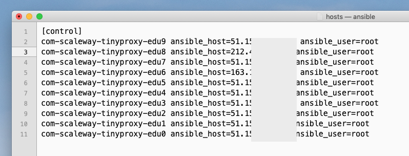

# apkspider

Recursive website crawler example.

## Features:

* [DFS](https://en.wikipedia.org/wiki/Depth-first_search) graph traversal crawler;
* bypasses CloudFlare with self-deployed proxy-network and pseudo-randomized user sessions;
* follows iterators interface close enough to reduce amount of App instances, stored in memory at once.

For edu purposes only. Lacks a lot of features (mostly, multithreading or async processing).  

**Output example:**

* `output/files.txt` — first 2000 links from `apkmirror.com` (with actual 302 redirects);
* `output/files_25.txt` — full contents of first downloaded 25 APK's, described as:
    ```
    archive name — file name — mime type — size deflated
    ``` 

## Install

```
pip install -r requirements/base.txt
```
### Configuring crawling settings

DFS is used to traverse APKMirror pages from root note. We manage stack of Pages, which are queued for parsing. Initial stack is Initialized with one element on on top — the root Page node.

After fetching root Page contests, we:

* add all newly retrieved Pages to stack if max recursion recursion depth allows it;
* piped all apps to generator-like interface directly without actual storing in memory.


If Page download error occurs, DownloadError is raised. Page is re-scheduled to download to the bottom of the stack, increasing it's own `retries_count`. It `retries_count` >= `max_retries_count`, safely removes from Page stack.

    # A list of HTTP proxies, which should be
    # used to fetch data. Good choice: https://tinyproxy.github.io.
    # E.g: ['http://77.88.55.77:8081', 'http://77.88.55.70:8081']
    proxies: tp.List[str] = None

    # Amount of hops from root node to fetch,
    # not actual depth of tree
    max_depth: int = 5

    # Domain settings to crawl
    scheme: str = 'http'
    network_location: str = 'www.apkmirror.com'

    # How much targer URLs to process
    apps_to_fetch: int = 2000

    # Root node path to traverse from
    root_path: str = '/'

    # How much times to re-download Page
    max_retries_count: int = 3

    # Will be used, when file in archive
    # has neither known mime-type nor extension
    # ref:http://www.rfc-editor.org/rfc/rfc2046.txt
    unknown_mime_failback = 'application/octet-stream'

    # Site-specific settings, may be different for other instances
    download_handler_path = '/wp-content/themes/APKMirror/download.php'
    download_app_page_suffix = '-download/'

### Configuring proxies

APKMirror uses CloudFlare as Anti-DDoS proxy-filtering network. We may occasionally trigger heuristics and get blocked, so it's better to proxy traffic via own small proxy network with white IPs.  

For test purposes, we use network of 10 Debian-based servers with attached white IPv4 IPs:


We use Ansible to bootstrap [Tinyproxy](https://tinyproxy.github.io) on each machine. Add proxy hosts to /etc/ansible/hosts:



Install role `oefenweb.tinyproxy` run Ansible role:

```yaml
---
- hosts: all
  roles:
    - oefenweb.tinyproxy
  vars:
    tinyproxy_port: 41318
    tinyproxy_allow:
      - "{{ ansible_lo['ipv4']['address'] }}"
      - "{{ ansible_default_ipv4['address'] }}"
```

As result you should get something like:


After this you can specify proxy URLs in config section (`crawler/config.py`).  

## Running tests

Install: 

```
pip install -r requirements/test.txt
```

Run with pdb on failure:

```
pytest -q --disable-warnings --pdb
```
